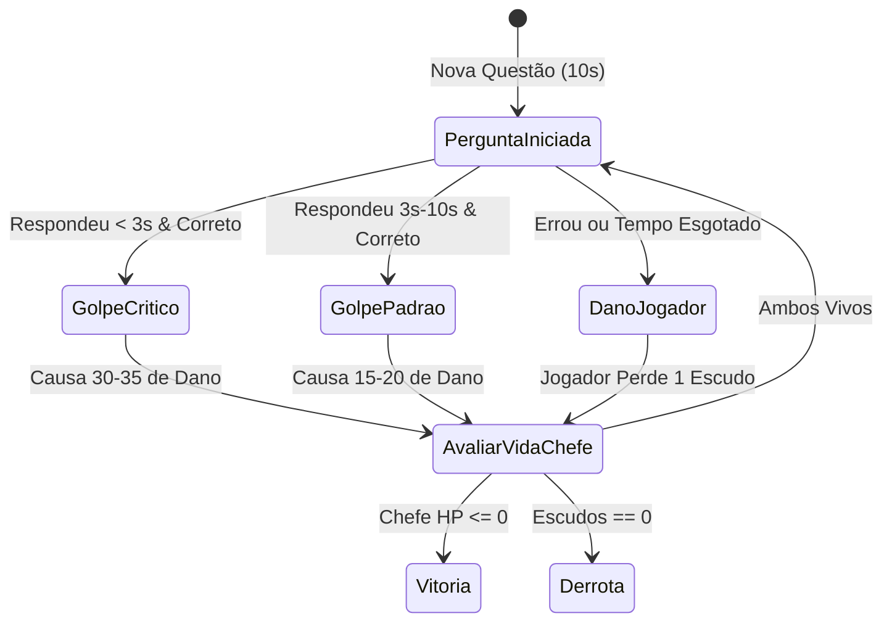

# 🎮 Modos de Treino, Jogos & Desafios

O **Quantora** combina cálculo didático com uma esteira dinâmica de desafios rápidos e gamificados para exercitar a agilidade aritmética mental.

Arquivos-fonte:
* `src/core/quiz/quizGenerator.ts`
* `src/core/daily/dailyEngine.ts`
* `src/core/quiz/blitzEngine.ts`
* `src/core/quiz/bossEngine.ts`

---

## 1. ⚡ Modo Treino Mental, Sobrevivência & Repetição Espaçada

Permite ao usuário praticar operações aritméticas dinâmicas em sobrevivência progressiva e fixar erros através do Caderno de Erros com repetição espaçada adaptativa.

### 🎯 Trilhas Disponíveis
1. **Soma (`soma`):** De somas básicas com números de 1 dígito a adições de 3 dígitos com transporte.
2. **Subtração (`subtracao`):** Subtrações controladas para evitar resultados negativos nos níveis iniciais.
3. **Multiplicação (`multiplicacao`):** Tabuada e multiplicações de 2 dígitos.
4. **Divisão (`divisao`):** Divisões inteiras exatas geradas via multiplicação prévia ($A = B \times C \implies A \div B = C$).
5. **Regra de Três Simples (`regra_simples`):** Problemas textuais curtos de proporcionalidade direta.

### 🛡️ Modo Sobrevivência
* O jogador inicia na conta `#1` e deve responder sequencialmente sem cometer nenhum erro.
* Cada acerto incrementa o recorde pessoal (`bestSurvivalRecord`).
* O nível de dificuldade e amplitude dos números crescem dinamicamente a cada 5 contas concluídas.
* Errar qualquer conta finaliza a rodada imediatamente.

---

## 2. 📅 Desafio Diário (Daily Challenge)

Mecânica de engajamento diário inspirada no Wordle, garantindo que **todos os usuários do mundo resolvam rigorosamente o mesmo problema a cada dia civil**.

### 🎲 Motor Pseudo-Aleatório Determinístico (PRNG)
* **Hash FNV-1a de 32 bits (`hashDateStringToSeed`):** Converte a string de data `YYYY-MM-DD` em um inteiro sem sinal único.
* **Algoritmo Mulberry32 (`createMulberry32`):** Gerador de números pseudo-aleatórios de 32 bits de altíssima uniformidade estatística, executado a partir da semente da data.
* **Categorias Rotativas:**
  1. `aritmetica`: Expressões combinadas com precedência de operadores.
  2. `porcentagem`: Cálculos rápidos de desconto, acréscimo e porcentagens do cotidiano.
  3. `algebra`: Equações lineares de 1º grau para encontrar o valor de $x$.
  4. `proporcao`: Relações de escala e regra de três prática.

### 🎁 Recompensas & Compartilhamento Social
* **Recompensa:** Concede fixamente **+150 XP** e incrementa a ofensiva diária (`streakDays`).
* **Timer Regressivo:** Exibe horas, minutos e segundos restantes até a meia-noite local (`getTimeUntilMidnight()`).
* **Botão "Compartilhar":** Copia para a área de transferência um texto amigável pronto para envio:
  ```text
  Quantora Desafio Diário (11/09) 🏆
  Acertou! 🔥 Streak: 4 dias
  ```

---

## 3. ⏱️ Modo Blitz (60 Segundos)

Modo frenético contra o relógio focado em velocidade de raciocínio.

### ⏳ Mecânica de Tempo Dinâmico
* **Tempo Inicial:** $60$ segundos.
* **Acerto:** Adiciona **+2 segundos** ao relógio.
* **Erro:** Subtrai **-3 segundos** do relógio (com piso em 0).

### 🔥 Multiplicadores de Combo
Acertos consecutivos aumentam o multiplicador de XP da rodada:
| Sequência de Acertos | Multiplicador |
| :---: | :---: |
| 0 a 2 acertos | $1\times$ |
| 3 a 4 acertos | $2\times$ |
| 5 ou mais acertos | $3\times$ |

* **Pontuação Final:** Calculada como $\text{Score} \times 10$ pontos base somados a bônus de combo e precisão.

---

## 4. ⚔️ Batalha de Chefe Matemático (Boss Rush)

Enfrentamento tático onde a velocidade de resposta dita a potência do golpe.



### 📊 Parâmetros do Confronto & Torre Procedural Infinita ($N = 1, \dots, \infty$)
* **Escalonamento Contínuo de HP:** Fórmula pura $HP_{max}(N) = 100 \cdot (1 + 0.35 \cdot (N - 1))$.
* **Teto Assintótico de Dificuldade ($N_{cap} = 15$):** A complexidade aritmética das perguntas escala até o nível 15; a partir daí, congela no patamar 15 (mantendo o cálculo mental humanamente viável), enquanto HP, frequência de debuffs e moedas continuam subindo sem limites.
* **Economia de Moedas do Chefe (`bossCoins`):** Recompensa de vitória calculada como $10 + 5 \cdot N$.
* **Forja de Upgrades Permanentes:** Bônus de dano base ($+3$ por nível) com custo base de 30 moedas e multiplicador geométrico de $1.5\times$.

### 🔥 Fases Dinâmicas do Chefe
1. **Fase 1 (HP > 50%):** Postura neutra com tempo padrão por questão (10s a 6s conforme o nível).
2. **Fase 2 (25% < HP $\le$ 50% — Sobrecarga):** Chefe entra em estado de fúria moderada com avisos visuais.
3. **Fase 3 (HP $\le$ 25% — *Enrage Mode*):**
   * Vinheta visual avermelhada pulsante na tela.
   * Dano crítico do jogador amplificado em $1.5\times$ (dano entre 45 e 52).
   * Penalidade brutal: erros ou estouro de tempo drenam **2 escudos** do jogador instantaneamente.

### 🌫️ Debuffs Cognitivos Dinâmicos
* **Névoa Algébrica (`fog`):** Aplica blur interativo na área da pergunta, forçando o jogador a passar o cursor ou focar para revelar os números.
* **Inversão Espectral (`mirror`):** Desafia a percepção espacial do jogador.
* **Dreno Temporal (`time_siphon`):** Reduz o cronômetro da rodada em 25%.

### 🧪 Consumíveis de Batalha (Compráveis no Arsenal)
* **Oráculo da Clarividência (`oracle` — 20 moedas):** Elimina 2 alternativas incorretas da questão atual, deixando apenas a resposta correta e 1 distrator.
* **Dilatação Temporal (`timeFreeze` — 25 moedas):** Pausa o cronômetro da rodada por 4 segundos completos.

### 🏆 Recompensas Especiais
* **Vitória Padrão:** Concede **+250 XP** e desbloqueia a conquista `boss_slayer` (*Matador de Chefes*).
* **Vitória Impecável (*Flawless*):** Derrotar o chefe mantendo os 3 escudos intactos concede a conquista rara `boss_flawless` (*Invicto*) com +350 XP.

---

## 🔗 Links Relacionados
* [[Quantora - Visao Geral]]
* [[Gamificacao & Niveis]]
* [[Lousa de Rascunho (Scratchpad)]]
* [[Suite de Testes & Qualidade]]
